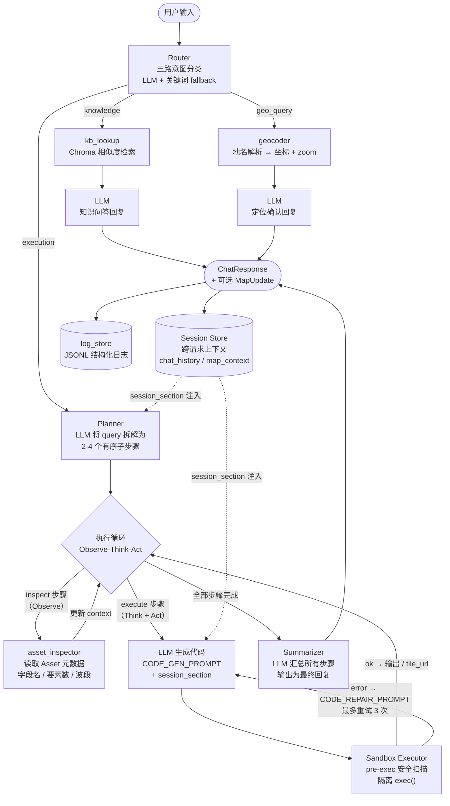

# GEE-Agent 助手

基于 **ReAct 架构**的 Google Earth Engine 智能助手，使用 FastAPI + Streamlit + Chroma 构建。

---

## 核心架构：ReAct Orchestrator

系统以一个 **Observe-Think-Act 循环**（ReAct）为核心，统一处理所有用户请求。每次对话先由 Router 分类意图，再走对应的执行分支，所有中间状态均通过 Session Store 跨请求持久化。



---

## 功能概览

| 意图         | 触发条件                     | 执行路径                                      |
|------------|--------------------------|-------------------------------------------|
| `knowledge`  | GEE 概念 / API 文档问题          | Chroma 检索 → KNOWLEDGE_PROMPT → LLM          |
| `geo_query`  | 地名 / 定位 / 导航请求            | geocoder tool → GEO_REPLY_PROMPT → LLM + MapUpdate |
| `execution`  | 数据分析 / 可视化 / 代码生成         | Planner → inspect* → execute loop → Summarizer |

---

## 目录结构

```
gee-agent/
├── backend/app/
│   ├── main.py                  # FastAPI 入口（仅挂载 /chat）
│   ├── api/
│   │   └── routes_chat.py       # POST /chat, POST /chat/stream,
│   │                            #   GET /chat/basemap,
│   │                            #   POST /chat/history, GET /chat/history/{id}
│   ├── core/
│   │   └── config.py            # settings.yaml 读取，含 ALLOWED_ORIGINS
│   ├── models/
│   │   └── chat.py              # ChatRequest/Response, MapContext/Update, WorkflowStatus
│   ├── agents/
│   │   ├── orchestrator.py      # ReAct 状态机主逻辑
│   │   ├── router.py            # 三路意图分类 (execution/knowledge/geo_query)
│   │   ├── prompts.py           # 所有 LLM prompt 模板（引用 SANDBOX_CONSTRAINTS_BLOCK）
│   │   ├── state.py             # WorkflowState TypedDict
│   │   └── session_store.py     # 跨请求 Session 内存持久化
│   ├── sandbox/
│   │   ├── env_rules.py         # SANDBOX_UNSAFE_PATTERNS + SANDBOX_CONSTRAINTS_BLOCK
│   │   └── executor.py          # MockMap + pre-exec 安全扫描 + 隔离 exec()
│   ├── tools/
│   │   ├── execution/
│   │   │   ├── gee_executor.py  # execute_gee_snippet()（委托 sandbox）
│   │   │   └── gee_tasks.py     # load_simple_asset(), run_ndvi_example()
│   │   ├── explanation/
│   │   │   ├── asset_inspector.py
│   │   │   └── kb_lookup.py     # 直接调用 chroma_store
│   │   └── geo/
│   │       └── geocoder.py      # resolve_place() → 坐标 + zoom 计算
│   └── services/
│       ├── llm_client.py        # Poe API (OpenAI 兼容)
│       ├── embeddings.py        # sentence-transformers all-MiniLM-L6-v2
│       ├── chroma_store.py      # Chroma 向量库读写
│       ├── geocoding.py         # 底层地理编码 API 调用
│       ├── gee_client.py        # GEE 连接初始化 + 底图配置
│       ├── log_store.py         # JSONL 结构化对话日志
│       └── db.py                # SQLite 连接预留（sessions + chat_history 表）
├── frontend/
│   ├── app.py                   # Streamlit 多页入口
│   ├── pages/
│   │   └── 1_Chat_Assistant.py  # 聊天界面 + Folium 地图
│   ├── components/
│   │   ├── chat_ui.py
│   │   └── map_view.py
│   └── services/
│       └── api_client.py        # chat(), chat_stream(), get_basemap_config(), save_history()
├── configs/
│   ├── settings.example.yaml    # 含 security.allowed_origins 配置
│   ├── models.yaml
│   └── gee_tasks.yaml
├── data/
│   ├── chroma/                  # Chroma 向量库持久化
│   └── logs/                    # JSONL 对话日志（运行后生成）
├── scripts/
│   ├── build_chroma_index.py
│   ├── test_gee_connection.py
│   └── test_geocoding.py
└── gee_rag_data/
    └── gee_api_docs_for_rag.txt # 知识库原始文档
```

---

## 环境配置与运行

### 1. 安装依赖

```bash
pip install -e .
```

### 2. 配置

```bash
cp configs/settings.example.yaml configs/settings.yaml
cp .env.example .env   # 填写 POE_API_KEY, GEOCODING_API_KEY, GEE_PROJECT_ID
```

`settings.yaml` 关键配置项：

```yaml
llm:
  default_model: "gpt-4"

gee:
  project_id: "your-project-id"

# 生产环境改为实际前端域名
security:
  allowed_origins:
    - "http://localhost:8501"
```

### 3. 构建知识库（首次）

```bash
PYTHONPATH=. python scripts/build_chroma_index.py
```

### 4. 启动后端

```bash
PYTHONPATH=. uvicorn backend.app.main:app --reload --port 8000
```

### 5. 启动前端

```bash
PYTHONPATH=. streamlit run frontend/app.py
```

---

## API 端点

| 方法   | 路径                          | 说明                         |
|--------|-------------------------------|------------------------------|
| GET    | `/health`                     | 健康检查                     |
| GET    | `/chat/basemap`               | 获取默认底图配置             |
| POST   | `/chat`                       | 一次性请求，返回 ChatResponse |
| POST   | `/chat/stream`                | SSE 流式推送工作流事件        |
| POST   | `/chat/history`               | 保存对话历史到 Session Store |
| GET    | `/chat/history/{session_id}`  | 读取指定 Session 对话历史    |

流式事件类型（`/chat/stream`）：

```
routing → planning → step_start → step_done → summarizing → done
```

---

## 安全设计

- **Sandbox 隔离**：LLM 生成的代码在 `sandbox/executor.py` 执行，命名空间仅含 `ee` 和 `Map`，与应用全局完全隔离。
- **Pre-exec 扫描**：执行前静态检测 `import os / subprocess / open() / eval()` 等危险模式，命中则拒绝执行。
- **CORS 收紧**：`allow_origins` 从 `settings.yaml` 读取，不再硬编码为 `*`。
- **约束单一来源**：所有 prompt 的沙箱规则统一引用 `sandbox/env_rules.SANDBOX_CONSTRAINTS_BLOCK`，避免多处维护。

---

## 验证脚本

```bash
PYTHONPATH=. python scripts/test_gee_connection.py
PYTHONPATH=. python scripts/test_geocoding.py "Hong Kong"
```

---

## 依赖说明

| 组件                    | 说明                                           |
|-------------------------|------------------------------------------------|
| Poe API (`POE_API_KEY`) | 未配置时聊天返回占位回复                       |
| earthengine-api         | 未认证时 execution 步骤返回占位/错误           |
| Chroma                  | 首次运行前执行 `build_chroma_index.py`         |
| sentence-transformers   | 首次调用时自动下载 `all-MiniLM-L6-v2`（≈90MB）|

